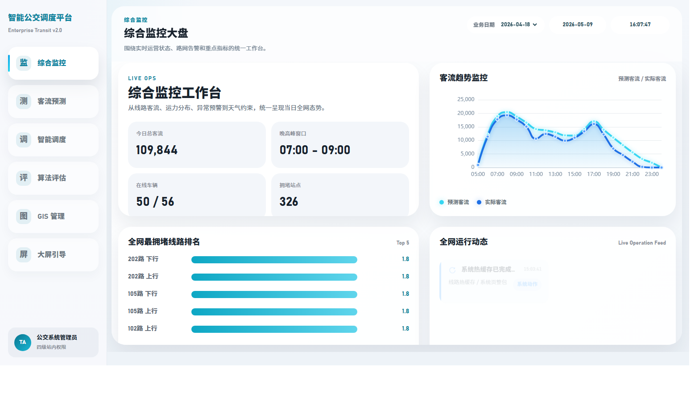
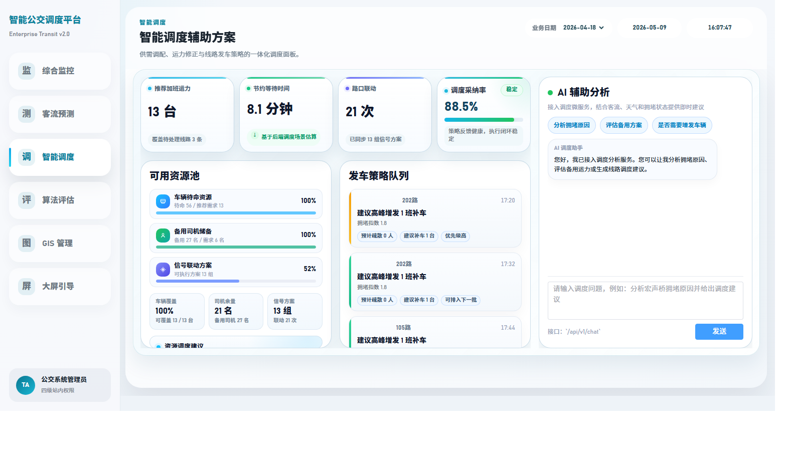
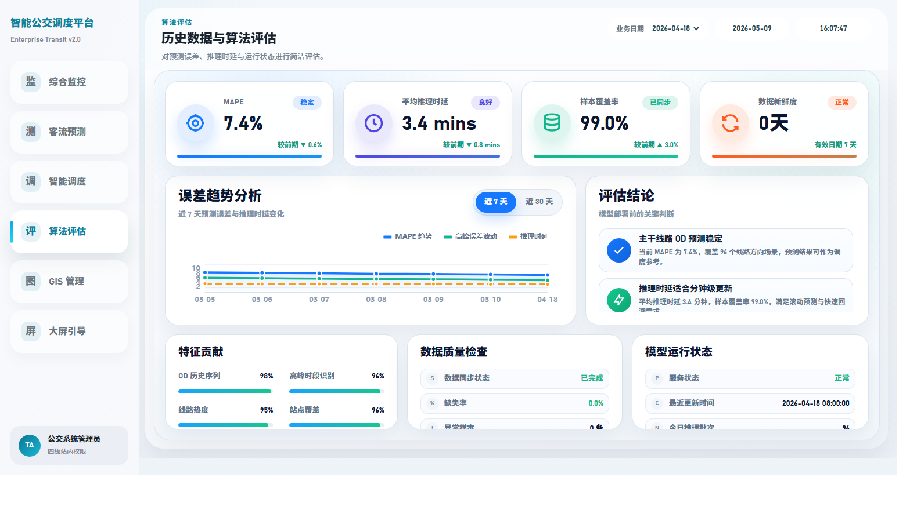
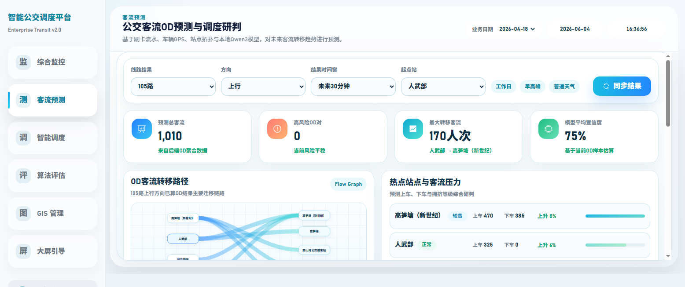
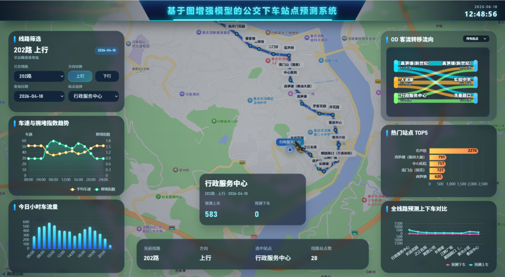

# 基于图增强模型的公交下车站点预测系统

本项目面向公交出行场景，结合乘客历史出行记录、公交线路站点关系、时间特征和空间特征，构建候选站点召回与排序预测流程，并引入图增强模型提升站点关系表达能力。

## 项目模块

- **odbus**：核心预测模型与数据处理脚本，包含候选召回与基于图增强的排序模型。
- **server**：后端服务，提供预测和可视化接口。
- **src**：Vue 前端展示界面，用于展示预测结果和站点拓扑信息。
- **蒸馏**：模型蒸馏优化代码，用于提升模型推理速度。

## 技术栈

- **前端**：Vue、JavaScript
- **后端**：Java、Spring Boot、Node.js
- **算法与数据**：Python、机器学习、图神经网络（GNN）、数据清洗与特征提取

## 快速启动

1. 配置相关环境依赖（参考各模块下的 `pom.xml` 或 `package.json`）。
2. 启动数据处理与模型预测服务。
3. 启动后端接口服务。
4. 运行前端项目进行可视化展示。

## 安全与配置

仓库不保存真实凭据。复制 `.env.example` 为本地 `.env`，通过 `VITE_AMAP_KEY`、`VITE_AMAP_SECURITY_JS_CODE`、`AMAP_WEATHER_KEY` 和 `MYSQL_PASSWORD` 配置运行环境。不要把 `.env`、编译目录或构建压缩包提交到 Git。

## 系统展示

### 1. 系统概览与综合看板

### 2. 公交 GIS 地图与调度监控

### 3. 客流数据与运营分析

### 4. 预测指标与热点站点

### 5. 实时综合调度大屏

